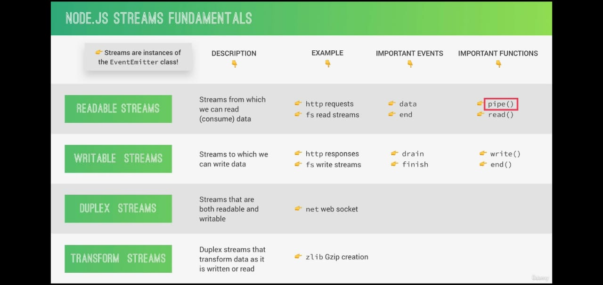
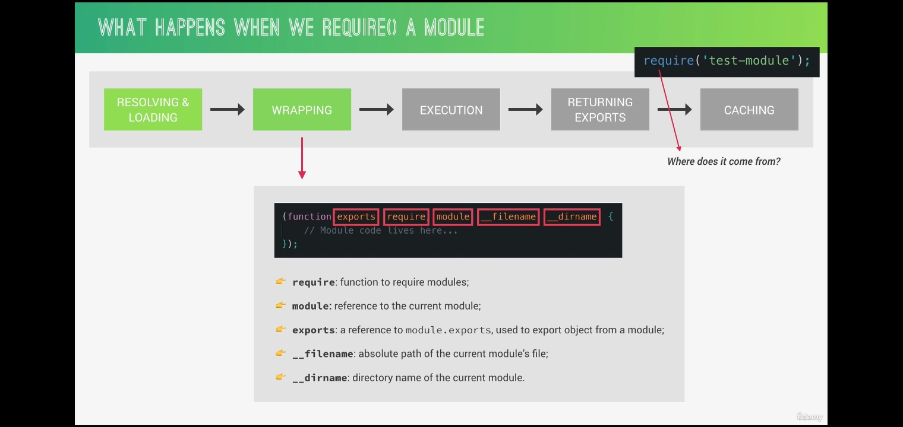
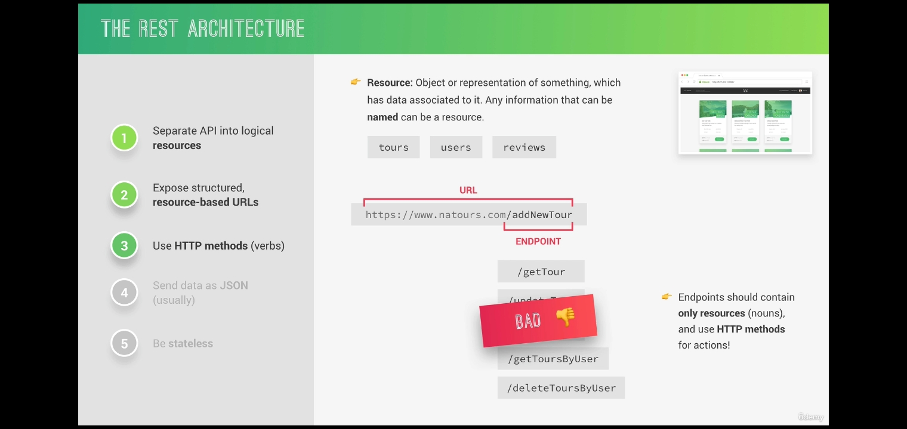
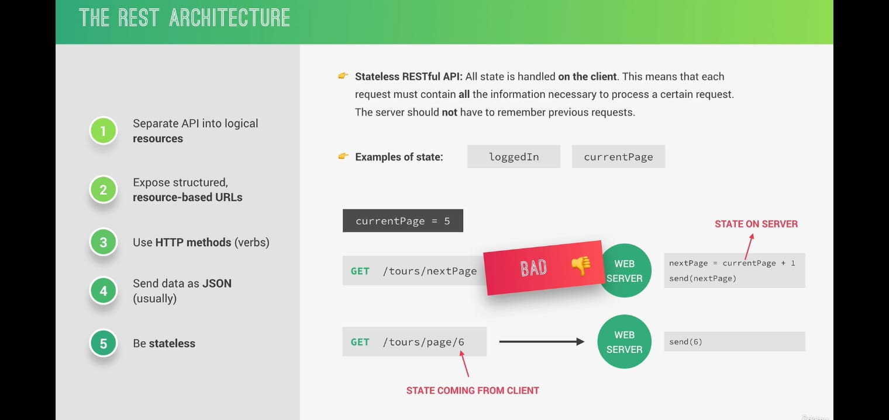
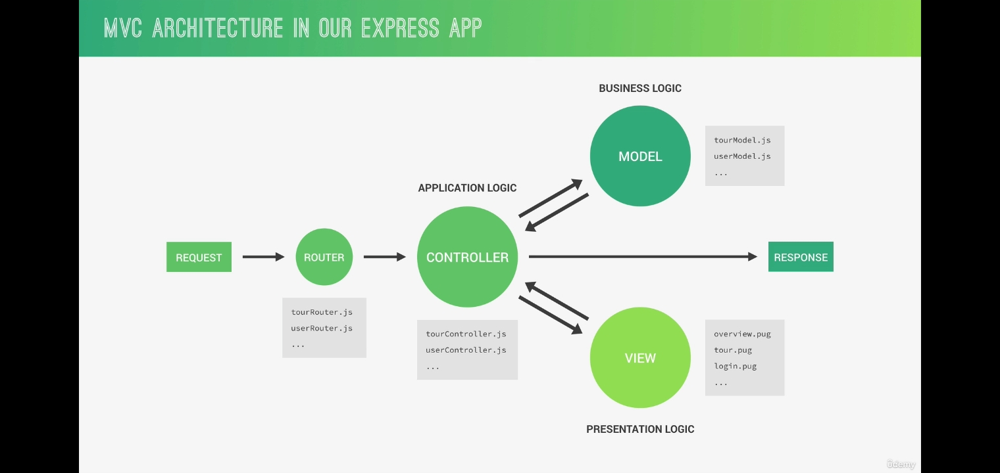
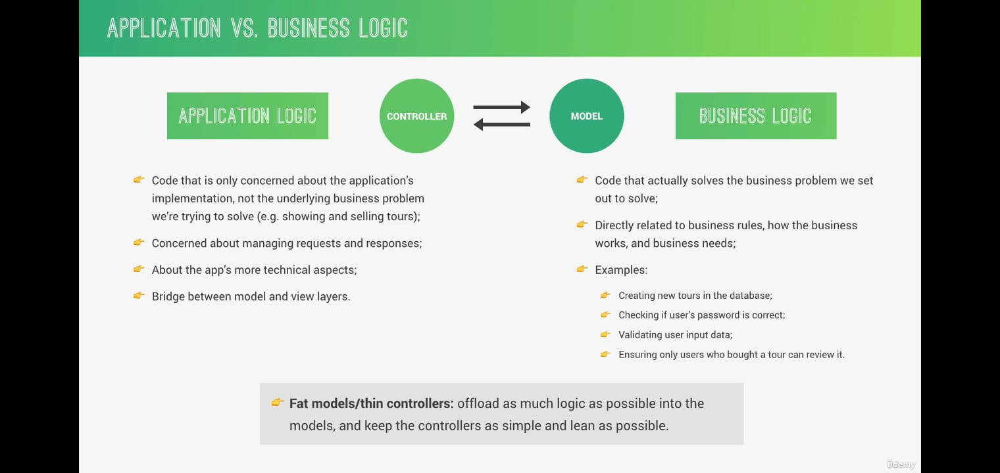

# Socket

- It is used to connect 2 people together.
- For 2 devices , to send and receive messages , we need to have sockets at both the ends .

# Chp 3

## What is node js

- It is not a program but a JavaScript runtime to run JS on a server.
- JavaScript runtime is the browser where we run the code.

## What it does

- It helps to read the HTML file from the server files when request is made by any http and then send the response back to the client.

## Asynchronous Nature of NodeJs

- Node js is Single Threaded means if there are millions of users and if one user is doing any function on it , then other users have to wait unless it finishes.
- By making the code asynchronous , the function will run in the background and once its completed , it will run for the user .
- This will solve time problem.

## fs

- file system module allows you to work with the file system on your computer.

## utf-8

- It is character encoding , if we dont use it , we will get some weird output.

## writeFile

- It is an asynchronous function used to write anything inside a file.

```JS
fs.writeFile("./text.txt" , "This is text written from index.js " , 'utf-8' , err => {
    console.log("The file has been written");
})
```

## readFile

- Used to read content of one file in async way.

```JS
fs.readFile("./greet.txt" , "utf-8" , (err , data) => {
    console.log(data);
});
```

## createServer

- This method is used to create a server.
- We need to use http behind it ,

```JS
const http = require("http");
http.createServer()
```

- All the content of the website , any changes in the routing , etc stuffs would be mentioned under this.

## req.url

- In http , when we createServer , we have 2 parameters which are req and res .
- If we used req.url , then it will give us the url of current page of the website.

## url.parse(req.url, true)

- Here url must be imported first like

```JS
const url = require('url');
```

- It is a method which returns the url object.
- We can get the query string , pathname , href , etc important properties through which

## writeHead

- It takes 3 digit status code , which is used to display the header in the network tab.
- Used to show the status.

## Rules for Reading api files

- Always read the api file above the callback function ie above the component function because whenever we visit that url , the api call will get refreshed which we don't want.
- Read the api file at the top as a global variable.

```JS
const data = fs.readFileSync("./data.json" , 'utf-8');
const dataObj = JSON.parse(data);

// This is the main function of the component.
const server = http.createServer((req , res) => {})

```

- Reason to use readFileSync and not readFile is that we can assign a variable to readFileSync which is easier to handle and use at different places and also we dont need to worry about waiting because it is used as global variabel so it will start running even before the API page is called . Once the hosting starts , API data will also be loaded.

## /anyText/g

- /g indicates all variables which are present .
- If we want to replace all those variables we can use this way.

```JS
    output = output.replace(//g, product.image);
```

## \_\_dirname VS ./

- This in node indicates the current directory in which we are in.
- **./** indicates the home directory ie the outermost files section.

## server.listen

- Used to create the url of the server / website to start running.
- Like localhost:8000.

```JS
server.listen(8000, 'localhost', () => {
    console.log('Server Started');
});
```

## Creating own modules

- These are things which we import using require() and path could be mentioned if its custom module.
- Creating own modules **reduces the space** in the same file.
- Main thing is to break the bigger **problems into smaller problems** which is done by modules.

## query String

- The extra part after the ? in the url is called query string and we can see it using url.parse(req.url , true).

```JS
// http://localhost:8000/product?id=2
// where query is   query: [Object: null prototype] { id: '2' }, so to use it, we use query.id
```

## application/json

- It shows the plain text on the web page if we use it as writeHead.

```JS
res.writeHead(200, { 'Content-type': 'application/json' });

```

## text/html

- It html format web page ie like normal web pages with proper styling if provided any.

```JS
res.writeHead(200, { 'Content-type': 'application/json' });

```

## Slugify

- It edits the query string part of the url.
- We can give the name we want and hide the id=0 part of the url.
- Can watch its documentation.
- It does help with Search Engine Optimization (SEO).
- If you want your website to rank high on Google search results, then url-slugs can help.

## HTTP request VS HTTP response

- From client to web is HTTP request.
- From web to client is HTTP response.

## Get, post , patch , put

- All of these are from client to web.
- Get is used to request the data.
- Post to send the data.
- Patch and put to modify the data.

# Chp 4

## interval exit reason

- Whenever we use timer in our node.js file, the execution stops once the timer is reached.
- It won't exit any server if its running. Else if there are just timers, we need to run the node from terminal everytime the timer stops.

```JS
setTimeout(() => console.log("2 sec"), 2000);
```

## Event Emitter and Event Listener

- Emitter **emits name events** whenever something happens on web like **request is sent**, timer expires, etc.
- Event Listener is used to **send the req and res** to the client side, and it is uses **server.on** which is an **instance of Emitter** which sends whatever action has been made like request event.

## Streams



### createReadStream and pipe()

- Whenever we use createReadStream, the request sending by it is too fast for the response writable stream and this is called backpressure.
- So the best solution is to use pipe(). It pipes the output from the read stream right into the output of writable stream and this will solve the problem of incoming and outgoing data speed.

```JS

server.on("request" , (res, req) => {
const readable = fs.createReadStream("fileName.txt");

readable.pipe(res);
// readableSource.pipe(writableDestination)
})
```

# Chp 6

## Express

- Express is a minimal node.js framework .
- It is 100% node.js and it makes the work alot easier.

## Routing in express

- We can use different methods like get , post , etc while routing and can send whatever we want.
- We don't need to manually mention the type like we used to do in node (text/html) , express already does it.
- We can easily send the status code before sending.

```JS
const app = express();

app.get('/', (req, res) => {
    res.status(200).send("Hi");
})

app.post('/', (req, res) => {
    res.status(200).json({message : "Hi" , name: "Vansh"});
})
```

## .listen in express

- It is same as in node.js but here it works even if u just give the port number . You dont need to mention the string like localhost or 127.0.0.1 thing. It works on any of the both if the port number like 3000 is correct.
- Port 6000 is considered as unsafe on chrome browser , so don't use it.

## Modules

- There are different modules like require, \_dirname which we often use in express or in nodeJs.
  

## Rest APIs

- Rest is an architecture of building APIs .
- It is a way which follows some rules of representing APIs in easier way.
  
  
- RULES
  - There must be different logical data in each resource or in each url.
  - Resource must not contain verbs in the word like getTour, addNewTour etc, just use noun in it.
  - It must be stateless means new resource must not depend on the previous resource because it is handled by client side.

## Object.assign

- It is used to merge 2 objects, good to use where we have to merge existing object and new object.

## sync Vs Async

- Use methods like **writeFile** when we are **in any callback method** like get, post, etc and use **writeFileSync** when we are in **global** ie not in any callback function.

## req.params

- It is the part which we define after : in the url.
- It is in object form.
- It is the best way to extract/find specific id data, based on the url and the json data stored.

```JS
// id is the param
app.get('/api/v1/tours/:id', (req, res) => {});
```

## bodyParser/ req error/ jsonParser

- express.bodyParser() is no longer bundled as part of express. You need to install it separately before loading.
- Use this whenever you **need req parameter** from the client side in our file.

```JS
const jsonParser = bodyParser.json();

const createTour = (req, res) => {
    console.log(req.data)
};

app.route('/api/v1/tours').post(jsonParser, createTour);


```

[Read More](https://stackoverflow.com/questions/9177049/express-js-req-body-undefined)

## 201

- Used to **show success** and has led to the **creation of a resource**.

## Route

- Route is used to **prevents us writing the same urls multiple times**.
- We can chain different methods like get, post, etc if their urls are same.

```JS
const getAllTours = (req, res) => {
  res.status(200).json({
    status: 'success',
    dataSize: toursRead.length,
    data: { toursRead },
  });
};
// createTour is also defined similarly in the actual code.
app.route('/api/v1/tours').get(getAllTours).post(jsonParser, createTour);
```

## Express Middleware

- Everything which **connects the requests to the response** is the middleware.
- The process of middleware where it goes to one middleware to another could be said as a **Pipeline**.
- This linear cycle of middlewares is called **Middleware stack**.
- We can also **create our own middleware**.

## Creating own middleware

- The 3rd parameter **next** is a Callback argument to the middleware function which will call the next middleware from the request response cycle once the current has stopped the execution.
- Use middleware after jsonParser, else it will throw error.

```JS
// Correct
router.route('/').post( jsonParser , tourController.checkBody , tourController.createTour);

// Wrong
router.route('/').post( tourController.checkBody , jsonParser , tourController.createTour);

const myModule = (req, res, next) => {
  // content
  next()
}
```

## Morgan middleware

- **morgan** is 3rd party middleware which makes life easier by mentioning the method and the url which has been requested.

```JS
const morgan = require('morgan');

app.use(morgan('dev'));

```

## Param Middleware

- It is inbuilt, so never use 4th parameter while making other custom middlewares.
- These are used with **router** which acceps parameters like `router.param('id', xyz)` where **id** is the param name **(http://localhost:3000/api/v1/tours/:id)** and xyz is the action we want to perform.
- **Before** running route in router, we could check if the **id is valid or not.** This takes out work of repeating the code to check the validity in each function.
- Don't forget to **use return and next()** .
- Return wont go on next which **stops the cycle** if its invalid. Stoping of cycle is important.
- next() will lead us to **next middleware** if its a valid id or url.

```JS
// tourRouter is the file where only router is defined and tourController is the file where the methods are defined and declared.

// in tourRouter
router.param('id', tourController.checkID);

// in tourController
exports.checkID = (req, res, next, val) => {
  console.log(val);

  const id = req.params.id;
  if (id > toursRead.length) {
    return res.status(404).json({
      status: 'fail',
      message: 'Invalid ID',
    });
  }
  next();
}
```

## Mounting

- It like defining a url in the start at one place and then using it as base url.
- It creates many small different applications in one application.

```JS
const router = express.Router()
```

## nodemon

- We can run our application using npm start by using nodemon.
- We can set our package.json file scripts to default file where our server port is defined.
- Whenever we define port in other file, we need to import the content in port file and not the port in content file.
- For eg,

```JS
// server.js file
const app = require('./app')

const port = 3000;
app.listen(port, () => {
  console.log(`App running from port ${port}`);
});

// app.js file
const express = require('express');
const app = express();

/// content///
module.exports = app;

// package.json file
  "scripts": {
    "start": "nodemon server.js"
  },
```

## module.exports

- Whenever we have files in different folders then always export the Router from it.
- If the file only contains methods/ functions , then export each of the methods manually .

```JS
exports.getAllTours = (req, res) => {
// content
};

exports.getTour = (req, res) => {
// content
};
```

## Environment Variables

- It is used to work on different environments which we create.
- By default, its development env.
- We can define it in any file with extension **.env**.
- We can import in other file by using **require(dotenv)** where we need to install the dotenv before using it .
- To log, we can use **process.env**

## How to connect MongoDb to project

- First copy the url from atlas website database and paste in the env file to save it.
- Replace <password> with the new password which you create from **Database Access** on the Atlas website.
- Create New Collection in **MongoDbCompass** and paste that url with proper password.
- Then in **server.js**, use **mongoose.connect** to connect the database with the project.

## Creating Database and pushing data

- First we create Schema.
- Second we create a model with model name and Schema name.
- Third step is to create data from that model.
- Last step is to save the data.

## Schema

- We can define its property with many different parameters like type, required: [boolean , message], default, etc .

```JS
const tourSchema = new mongoose.Schema({
  name: { type: String, unique: true, required: [true, 'Tour must have a name'] },
  rating: {
    type: Number,
    default: 4.5,
  },
  price: { type: Number, required: [true, 'Tour must have a price'] },
});
```

## Mongoose Model

- Accepts the name of the model and the Schema of it.

```JS
const Tour = mongoose.model("Tour" ,tourSchema);

```

## Mongoose Data related to Model

- MongoDBCompass automatically creates a plural name conventional data like here it create tours in the Compass.

```JS
const testTour = new Tour({
  name: 'Test Tour',
  rating: 5.4,
  price: 400,
});
```

## Mongoose save

```JS
testTour.save().then(data => console.log(data)).catch(err => {
  console.log("Made an error: ", err);
})
```

## Another way of sending data in Model (First was save)

- Model have many inbuilt methods to use like create, save, etc which could be used.

```JS
// Here Tour is a model imported from another file.
  const newTour = await Tour.create(req.body);
  res.status(200).json({
    status: "success",
    data: {
      tour : newTour
    }
  });
```

## MCV Achitecture (Model Controller View)

- Model is related to application data and business logic.
- Controller is to handle application request, to interact with models and send back responses to client.
- View is used when we have graphical representation.
  

  

## findOne and findById

- Both does the **same work**, as we are using mongoose then it just ease the task by creating **findById**.
- **findById** works same as **findOne behind the scenes** and we just need to pass params.id in the **findById** .

```JS
  const tour = await Tour.findById(req.params.id);
  // const tour = Tour.findOne({_id: req.params.id})
```

## error: Cast to ObjectId failed for value "3" (type string) at path "\_id" for model "Tour"

- This occurs when we pass the user defined **id** instead of MongoDb inbuilt made **\_id**.
- Usually when we use **req.params.id**, we have numbers like 1,2,3, etc but \_id is unique and its value is too big like string of 32 characters.

## Delete Tour

- It is a convention to not send or log any data when we delete anything.

## deleteMany

- If we want to delete everything in data, just use **deleteMany()** with empty paranthesis.

## process.argv

- The process.argv property is an inbuilt application programming interface of the process module which is used to get the arguments passed to the node.js process when run in the command line.

```JS
// in terminal
// node filePath --import, here filePath is the local path where the file is located
INPUT : node dev-data/data/import-dev-data.js --import

OUTPUT : [
  'C:\\Program Files\\nodejs\\node.exe',
  'C:\\Users\\vansh\\Desktop\\NodeJs_Things\\dev-data\\data\\import-dev-data.js',
  '--import'
]
DB connection successful
Data successfully imported

// in file.
if (process.argv[2] == '--import') {
  importData();
} else if (process.argv[2] == '--delete') {
  deleteData();
}
```

## process.exit()

- Used to exit/close the port.

## req.query

- This returns the string part of the url where we specify the conditions we want.
- Used to filter different data through those conditions.
- In the example, duration, difficulty and page are the keys in the query object.

```JS
// Url
http://localhost:3000/api/v1/tours?duration=5&difficulty=easy&page=30

// Query Object
// { duration: '5', difficulty: 'easy' }

```

## Finding queries and Filtering

- We can **filter** some of the queries we don't require from the **query object**.
- Like if we **don't need** page from the above example then we can **make array** of different queries we don't want and then **delete** each from the query object.
- We have used **await after all the task** has been completed on the queryObj, else it would **return the string without filtering** and then **again return once the filter** has been done. It is a fast process which we wouldnt have seen on the website as the data is too small in this example.

```JS

// Query Object Before Filtering
// { duration: '5', difficulty: 'easy', page: 30 }

    const queryObj = req.query;
    // exludeFields contains all the keys which we don't want.
    const exludeFields = ['page', 'limit'];
    // Here we are filtering the not needed query properties from the query object.
    exludeFields.forEach(el => delete queryObj[el]);

// Used to find the conditional query in the object.
    const query = Tour.find(queryObj);

    const tours = await query;
    // Query Object After Filtering
// { duration: '5', difficulty: 'easy' }
```

- Another way of filtering is to use special mongoose methods like **where, equals, lt**, etc. Check the documentation for it.

## Sorting

- We can sort the API based on the properties mentioned in the URL like **..?sort=price,ratingAverage**.
- Here we need to split the price and ratingAverage and then join by space as we want it in the form "price ratingAverage" . `const sortBy = req.query.sort.split(',').join(' ');`
- Here if the price is same in any case then it will sort wrt ratingsAverage.

```JS
   // Sorting
    if (req.query.sort) {
      const sortBy = req.query.sort.split(',').join(' ');
      query = query.sort(sortBy);
    }
```

## Use of - sign in select method

- We can exclude few methods so that client couldn't see that property.
- By this, we can hide the password from the clients and abstract it.

```JS
// This is remove all the __v named properties from the objects.
      query = query.select("-__v");

```

## - sign with price property

- Whenever we use - sign, it indicates that we want the order as descending.

```JS
// Here ratingAverage with be sorted in descending order.
    req.query.sort = '-ratingAverage';

```

## Limiting

- Used to display only the properties which has been asked.

```JS
// URL
// http://localhost:3000/api/v1/tours?fields=name,duration,difficulty,price

    if (req.query.fields){
      const fields = req.query.fields.split(',').join(' ');
      query = query.select(fields);
    } else{
      query = query.select("-__v");
    }

```

## Pagination

- Used to **display pages for limited datas** like if there are 100k data then we dont want it to display everything data on 1 page.
- We set **limited datas** on each page and move to the user required page number.
- We use **countDocuments()** method if the requested page exceeds the number of pages present .

```JS
    const page = req.query.page * 1 || 1;
    // Limit says the number of data in one page. Setting default as 100 datas.
    const limit = req.query.limit * 1 || 100;
    // skip is used to skip the starting datas if the page requested is not 1. Like if user needs 3rd page, then we need to skip the initial datas
    // on each page which could be found out by relating with the limit.
    const skip = (page - 1) * limit;

    query = query.skip(skip).limit(limit);

    if (req.query.page) {
      const numTours = await Tour.countDocuments();
      if (skip >= numTours) throw new Error('This page exceeds limit of pages.');
    }

```

## return this

- We use return this to return the whole object.
- A trick when we have nothing to return.

## Aggregate pipeline and Aggregate operations

[Aggregate pipeline Doc](https://www.mongodb.com/docs/manual/reference/operator/aggregation-pipeline/)
[Aggregate operators Doc](https://www.mongodb.com/docs/manual/reference/operator/aggregation/)

- Can refer the doc, as many useful things could run by refering it.
- Aggregate pipeline **$group** must have **\_id** field which separates different datas.
- **Aggregate pipelines** are written outside and inside pipelines we write **operations**.

```JS
    const stats = await Tour.aggregate([
      {
        $match: { ratingsAverage: { $gt: 4.5 } }
      },
      {
        $group: {
          _id : "$difficulty",
          numTours : {$sum : 1},
          avgRating : {$avg : "$ratingsAverage"},
          minPrice : {$min : "$price"},
          maxPrice : {$max : "$price"}
        }
      }
      ])
```

## $sort

- To get in descending order, use **-1** and to get in ascending order use **1**.

```JS
$sort : { numToursStart: -1 }
```

## $addFields

- Used to add any extra data property to display with the group.

```JS
      {
        $addFields : {month: "$_id"}
      },
```

## $project

- Used to remove any property which we dont want to display.

```JS
      {
        $project : {
          _id: 0
        }
      }
```

## round

- Used to round the decimal number.

```JS
          avgRating: { $avg: {$round: [
          "$ratingsAverage",
          0 ]}, },

```

## Virtual Properties

- Virtuals properties are document properties you can **get** and **set** but are **not saved in MongoDB**.
- We have to **define virtual properties in Schema** as well, else it won't work.
- It is a **business logic** therefore will define it in the **Model files** to follow **lean controllers and fat models** which says to write business logic in Models as much as possible and keep controller lean with the business models.
- These are used for combining fields and showing a combined result in the **document** (document is the data we get after calling any url from postman).
- We **cannot use arrow functions** here because we need this keyword, which are not applicable for arrow functions.
- We **cannot use any query** on it (like Tour.find(xyz)) as it doesn't exist in MongoDB.

## Mongoose Middleware

- There are 3 types of middlewares in mongoose to **handle something between the 2 events** like between saving document and actual saving into the database.
- Therefore these are also called **pre** and **post hooks**.

## Document Middleware

- Document Middleware can be used to do actions before and after creating any new document like when we use create operation, we could add slug in it before it gets inserted in the documents.
- Dont forget to add slug in the Schema as String because it is inserted in the documents with other properties.
- Runs for **save** and **create** only and **not for update**.

```JS
tourSchema.pre("save", function(next) {
  this.slug = slugify(this.name, {lower: true})
  next();
})
```

## Query Middleware

- Can be used to hide certain documents before any query runs like Tour.find().
- Can be used to calculate the time taken before and after query is triggered.
- The find used here is the **regular expression** used because we want it to be **applied to all queries** which **starts with find**.

```JS
tourSchema.pre(/^find/, function(next) {

  // Displays only the tours which are not equal to true ie not secretTour.
  // secretTour is defined in the Schema and is set as true by us while posting the secret tour document from the postman.

  this.find({secretTour : {$ne : true}})
  next();
})

```

## Renaming document column name

- To rename the column name, we can use aggregate function and query in the mongosh from Command prompt.
- We can use one command and change it.

```JS
// To use mongosh in cmd, type mongosh
db.tours.updateMany({}, {$rename: "duration" , "durationDays"})
```

## Validators and Inbuilt Validators

- We can use validators to get **correct/valid inputs** from the user.
- We can use it on post, patch methods to meet those conditions.
- While **patch**, we must set **runValidators as true** to check those conditions.
- **Inbuilt validators** could be min, max, enum, maxLength, minLength, etc.
- **enum** is used to mention the specific input values and if the input doesn't match any of those then it will throw error.

```JS
// In Schema
    difficulty: {
      type: String,
      required: [true, 'A tour must have a difficulty'],
      enum: {
        values: ['easy', 'medium', 'difficult'],
        message: 'Difficulty is either: easy, medium, difficult',
      },
    },
    ratingsAverage: {
      type: Number,
      default: 4.5,
      min: [1, 'Rating must be above 1.0'],
      max: [5, 'Rating must be below 5.0'],
    },

// At update place
exports.updatingTours = async (req, res) =>
    const tour = await Tour.findByIdAndUpdate(req.params.id, req.body, {
      runValidators: true
    });
```

## Custom Validators

- We can also import the validator from npm, it has many such validators which are useful and its document is [here](https://github.com/validatorjs/validator.js/)
- Creating validator is also not tough.

```JS
    maxGroupSize: {
      type: Number,
      required: [true, 'A tour must have a group size'],
      // here
      validate: {
        validator: function(val){
          return val < 50;
        },
        message: "Group size must be smaller than 50"
      }
      //  validate: function(val){return val < 50} This is validate without any other condition like message.
    },
```

## Error middleware and how to call it

- To call error middleware, pass **next(err)**.
- We never pass anything inside next but only in error case we do so and therefore express directly jumps to the handling middleware.
- Error Middleware contains 4 args, and we can define our error handling in that.

## Global Error Handling

- Doing try catch block at every method is not efficient and makes our code kinda too big.
- Instead, create 2 errorHandling files . 1 as utils and 1 as errorController.
- ErrorController must have:

```JS
module.exports = (err, req, res, next) => {
  // Where 500 is set to default if there are no values
  err.statusCode = err.statusCode || 500;
  err.status = err.status || 'Failed';

  res.status(err.statusCode).json({
    status: err.status,
    message: err.message,
  });
};

```

- Another file could handle every error by using classes which contains:

```JS
class AppError extends Error{
    constructor(message, statusCode) {
        super(message);

        this.statusCode = statusCode;
        this.status = `${statusCode}`.startsWith('4') ? 'fail' : 'error';

        Error.captureStackTrace(this, this.constructor);
    }
}

module.exports = AppError;
```

- Lastly, wherever we want to handle the error we can use this (here in tourController.js)

```JS
const catchAsync = (fn) => {
  // Here return is used because we want to stop the middleware from executing after this. Otherwise it would continue to go to other middlewares.
  return (req, res, next) => {
    fn(req, res, next).catch(next);
  };
};


exports.getAllTours = catchAsync(async (req, res) => {
  const features = new APIfeatures(Tour.find(), req.query).sortApi().limitingFields().pagination();
  const tours = await features.apiData;

  res.status(200).json({
    status: 'success',
    dataSize: tours.length,
    data: tours,
  });
});
```
